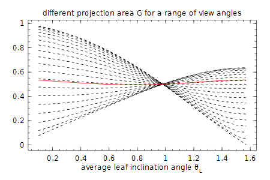
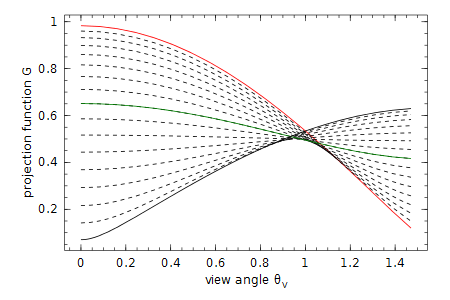
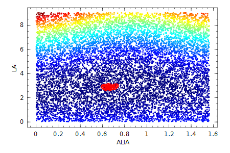

# LAI estimation

This package provides several methods to estimate LAI. All of them are based on the same inversion model.

## Model

We estimate LAI from the gap fraction through inversion of the Poisson model:

```math
T(\theta_V) = \exp\big(-k(\theta_V) L_e\big) = \exp\Big(-\frac{G(\theta_V)L_e}{\cos\theta_V}\Big)
```

with 

* ``T(\theta_V)``: the observed **t**ransmission or gap fraction,
* ``\theta_V``: the **v**iew zenit angle,
* ``L_e``: the **e**ffective **L**eaf Area Index with ``L_e = L \cdot\Omega`` and ``\Omega`` the cluming factor/correction,
* ``k(\theta_V)``: the extinction coefficient that depends on ``G(\theta_V)``, and
* ``G(\theta_V)``: the projection function, which in its turn depends on a leaf angle distribution.

Further, the contact frequency ``K`` is defined as ``K(\theta_V) = G(\theta_V) \cdot L_e = -\log T(\theta_V) \cos \theta_V`` and is used as observed value to compare with the modelled value for LAI fitting.

## Projection function

The projection function accounts for the interaction between the incoming beam of light from direction ``(\theta_V, \phi_V)`` with the leaves assuming a certain leaf angle distribution with leave angles ``(\theta_L, \phi_L)``. More specifically, the projection function is the mean projection of a unit foliage area in the direction ``(\theta_V, \phi_V)``.

In general the projection function ``G(\theta_V, \phi_V)`` is definded as:
```math
G(\theta_V, \phi_V) = \frac{1}{2\pi}\int_0^{2\pi}\int_0^{\pi/2}\lvert\cos\psi\rvert g(\theta_L,\phi_L)\sin\theta_L \mathrm{d}\theta_L\mathrm{d}\phi_L 
```
with ``\cos\psi = \cos\theta_V\cos\theta_L + \sin\theta_V\sin\theta_L\cos(\phi_V - \phi_L)``.

For forest canopies the azimuth leaf angle ``\phi_L`` distribution is often assumed constant which reduces ``G`` to
```math
G(\theta_V) = \int_0^{\pi/2}A(\theta_V,\theta_L)g(\theta_L)\mathrm{d}\theta_L
```

with a direction function ``A``: 
```math
A(\theta_V, \theta_L) = \begin{cases} 
    \cos\theta_V\cos\theta_L, & \quad\lvert\cot\theta_V\cot\theta_L\rvert>1 \\ 
    \cos\theta_V\cos\theta_L[1+\tfrac{2}{\pi}(\tan\beta - \beta)], &\quad\text{otherwise}
\end{cases}
```
with ``\beta = cos^{-1}(\cot\theta_V\cot\theta_L)``.

The projection function ``G(\theta_V)`` as well as the leaf angle distribution function ``g(\theta_L)`` must obey the following normalization functions:
```math
\int_0^{\pi/2}G(\theta_V)\sin\theta_V\mathrm{d}\theta_V = \tfrac{1}{2}
\int_0^{\pi/2}g(\theta_V)\sin\theta_V\mathrm{d}\theta_V = 1
```

## Leaf Angle Distribution

The standard leaf angle distribution is the _ellipsoidal_ distribution with 1 parameter ``\chi``:

```math
g(\theta_L; \chi) = \frac{2\chi^3\sin\theta_L}{D(\cos^2\theta_L + \chi^2\sin^2\theta_L)^2} 
```

with ``D \approx \chi + 1.774(\chi+1.182)^{-0.733}``.

The resulting projection function then becomes (formula(A.6) in Thimonier et al. 2010[^2]):

```math
G(\theta_V; \chi) = \frac{\cos\theta_V\sqrt{\chi^2 + \tan^2\theta_V}}{\chi + 1.702(\chi+1.12)^{-0.708}}
```

Thimonier et al. 2010[^2]: If the vertical semi-axis is ``a`` and the horizontal semi-axis ``b``, the ellipsoidal leaf angle distribution parameter is defined as ``\chi = b / a``. 

The parameter ``\chi`` is directly related to the **a**verage **l**eaf **i**nclination **a**ngle (ALIA) ``\bar\theta_L`` through formula (30) in [Wang et al 2007](https://www.researchgate.net/profile/Zhao-Liang_Li/publication/223802149_Comparison_of_leaf_angle_distribution_functions_Effects_on_extinction_coefficient_and_fraction_of_sunlit_foliage/links/0a85e52f1171314efe000000.pdf):
```math
\chi \approx \Big(\frac{\bar\theta_L}{9.65}\Big)^{-0.6061} - 3
```


As an example we plot the ellipsoidal for different average leaf angles:

```julia
g(θL, χ) = 2χ^3 * sin(θL) /( (χ + 1.774(χ + 1.182)^-0.733) * (cos(θL)^2 +  χ^2*sin(θL)^2)^2)
ALIA_to_x(ALIA) = (ALIA/9.65).^-0.6061 - 3
using Winston
p = plot()
for alia in linspace(5 *pi/180, 85 *pi/180, 10)
    oplot(θL -> g(θL, ALIA_to_x(alia)), 0, pi/2, "--")
end
title("leaf angle distribution \\theta_L for different average leaf angles")
ylim(0, 5) ; xlabel("leaf angle \\theta_L")
```


## Estimation methods

This package implements 5 different estimation methods, of which we recommend to use `ellips_LUT` and `ellips_opt`:

* Fixed zenith angle of 1 radian ≈ 57.5ᵒ: `zenith57`
* Miller's method `miller`
* Lang's method `lang`
* Ellipsoidal leaf angle distribution with Lookup Table estimation `ellips_LUT`
* Ellipsoidal leaf angle distribution with optimization estimation `ellips_opt`

All methods take as argument a PolarImage and a threshold, eg `ellips_LUT(polarimg, thresh)`.

### Zenith 57

At a viewing angle ``\theta_V`` of 1 rad ≈ 57.5``^o`` the projection function is almost independent of the leaf angle distribution. 

For example, with the ellipsoidal distribution we get
    
```julia
ALIA_to_x(ALIA) = (ALIA/9.65).^-0.6061 - 3
G(θᵥ, χ) = cos(θᵥ) * sqrt(χ^2 + tan(θᵥ)^2) / (χ+1.702*(χ+1.12)^-0.708)
using Winston
p = plot()
for θᵥ in linspace(0, pi/2-0.01, 20)        
    oplot(θL -> G(θᵥ, ALIA_to_x(θL)), 0.1, pi/2, "--")     
end
θᵥ57 = 1 #in radian
oplot(θL -> G(θᵥ57, ALIA_to_x(θL)),  0.1, pi/2,"-r")
title("different projection area \G for a range of view angles")
xlabel("average leaf inclination angle \\theta_L ")
```



This method is used for the initial starting point of the `ellips_opt` method. 

    LAI57 = zenith57(polimg, thresh) 

### Miller's method

Assuming a constant leaf angle, by integration the effect of ``G(\theta)`` disappears ([Miller 1967](https://www.researchgate.net/publication/236770486_A_formula_for_average_foliage_density)):
```math
L = 2 \int_0^{\pi/2} -\ln(P_0(\theta))\cos\theta \sin\theta \mathrm{d} \theta
```

For this method you need the entire viewing angle up to π/2, which might prove difficult for larger zenith angles (Weiss et al. 2004[^1]). Furthermore, the integration over the discrete polar distances of each pixel requires an ambiguous choice of grouping consecutive rings.

### Lang's method

Lang 1986 approximated ``-\ln(P_0(\theta))\cos\theta = K(\theta) \approx a + b\theta`` around ``\theta_V`` of 1 rad and obtained 
```math
L = 2(a+b)
```

We follow Weiss et al. 2004[^1] to regress between 25``^o`` and 65``^o``.

### Ellipsoidal ALIA estimation

We can also estimate the parameter ``\chi`` of the ellipsoidal leaf distribution together with the LAI. 

We follow Thimonier et al. 2010[^2] and use the contact frequency ``K``, with 
```math
K(\theta_V) = G(\theta_V, \chi)L_e = -\ln[T(\theta_v)] \cos\theta_V
``` 

as the fitting observable. We found more variance over the view zenith range with ``K`` (plot below) compared to using ``\ln T(\theta_V)`` (as [Norman & Campbell 1989](http://link.springer.com/chapter/10.1007%2F978-94-009-2221-1_14)) or ``T(\theta_V) = \exp(-G(\theta_V, \chi)L_e/\cos\theta_V)`` (as Weiss et al. 2004[^1]).

```julia
    ALIA_to_x(ALIA) = (ALIA/9.65).^-0.6061 - 3
    G(θᵥ, χ) = cos(θᵥ) * sqrt(χ^2 + tan(θᵥ)^2) / (χ+1.702*(χ+1.12)^-0.708)
    using Winston

    alia = (5:5:85)*π/180
    p = plot()
    
    f(i) = θᵥ ->  G(θᵥ, ALIA_to_x(alia[i]))
    # uncomment below for comparison
    #f(i) = θᵥ ->  exp(-G(θᵥ, ALIA_to_x(alia[i])) / cos(θᵥ))
    #f(i) = θᵥ ->  - G(θᵥ, ALIA_to_x(alia[i])) / cos(θᵥ)

    oplot(f(1), 0, π/2-0.1, "-r")
    for i = 2:length(alia)-1
        oplot(f(i), 0, π/2-0.1, "--")
    end
    oplot(f(int(length(alia)/2)), 0, π/2-0.1, "-g") #pi/4
    oplot(f(length(alia)), 0, π/2-0.1, "-k")
    ylabel("projection function G")
    xlabel("view angle \\theta_V")



Both the Lookup Table approach `ellips_LUT(polarimg, thresh)` from [Weiss et al. 2004][^1] and the optimization method `ellips_opt(polarimg, thresh)`from Thimonier et al. 2010[^2] are implemented. 

We do not weight the different gap fractions per zenith angle as in Thimonier et al. 2010[^2], but we use weighted rings with each a similar amount of pixels. We also use more view zenith rings than in the originals papers because digital cameras have much more pixels these day.

We find the parameter space to optimize is smooth and can be seen in a heat map with LUT values and 25 closest solutions in red circles:



[^1]: [Weiss et al 2004](http://www.researchgate.net/profile/Inge_Jonckheere/publication/222931516_Review_of_methods_for_in_situ_leaf_area_index_(LAI)_determination_Part_II._Estimation_of_LAI_errors_and_sampling/links/09e4150cefe5a4fea5000000.pdf)
[^2]: [Thimonier et al 2010](http://www.schleppi.ch/patrick/publi/pdf/atal10b.pdf)
